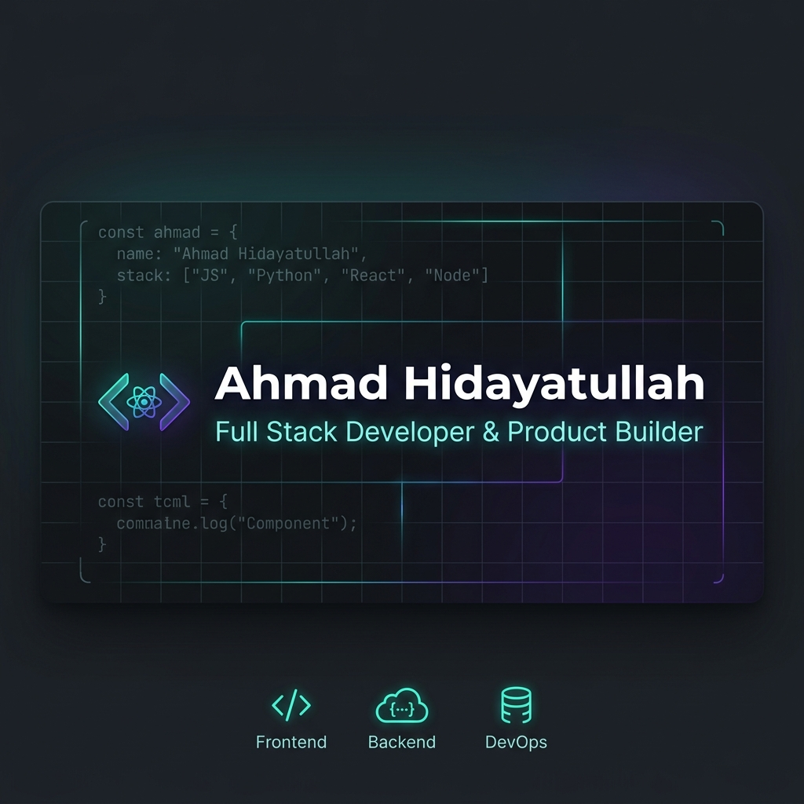

# Ahmad Hidayatullah - Personal Portfolio



A high-performance, multilingual professional portfolio engineered by **Ahmad Hidayatullah**, a Full Stack Developer, Product Builder, and Information Systems student. This site is meticulously crafted to showcase my projects, technical skills, architectural decisions, and detailed case studies, optimized specifically to provide a premium experience for international recruiters, hiring managers, and prospective clients.

**🌍 Live URL:** [website-portofolio-pi-ruby.vercel.app](https://website-portofolio-pi-ruby.vercel.app/)

---

## 🎯 Project Goals & Architecture

This portfolio is built with a feature-first architectural mindset, prioritizing clean code, performance, and accessibility. It operates without a CMS, relying on a robust static content data structure to ensure lightning-fast load times and uncompromised SEO capabilities.

### 🛠️ Tech Stack
- **Framework**: Next.js 16 (App Router & Turbopack)
- **Language**: TypeScript
- **Styling**: Tailwind CSS v4
- **Component Library**: shadcn/ui
- **Internationalization (i18n)**: next-intl (Fully localized dynamic routing for `/en` and `/id` via middleware)
- **Theme Manager**: next-themes (Light/Dark/System support)
- **Icons**: lucide-react
- **Deployment**: Vercel

---

## ✨ Key Features

- **Global Internationalization**: Seamless toggling between English and Indonesian, with all copy professionally localized and dynamic routes automatically adapting to the active locale segment.
- **Pulsing Availability Badge**: A dynamic visual indicator in the global navigation bar showing "Open to Roles" or "Tersedia" based on locale, immediately signaling availability to recruiters.
- **GitHub Showcase Section**: Premium simulated GitHub repository cards on the home page highlighting my active public codebases (like the Android ML app *HitungUang* and this very portfolio).
- **Dynamic Projects Grid**: A responsive listing page featuring custom visual thumbnails and smooth hover zoom animations.
- **Detailed Case Studies**: Structural, deep-dive write-ups for each project detailing the Overview, Problem, Goal, Solution, Architecture, Challenges, and measurable Results.
- **Dynamic Resume System**: Displays professional background, education, and automatically syncs project details directly from the codebase's content data. Includes support for downloading an ATS-friendly PDF.
- **SEO & Search Console Readiness**: Pre-configured `robots.txt`, dynamic `sitemap.xml`, custom OpenGraph meta imagery (`metadataBase`), and semantic layout metadata tags.

---

## 📐 Directory Structure

The codebase is organized using a feature-based architecture to maintain scalability and clear domain boundaries:

```text
portfolio/
├── messages/               # Localization strings (en.json, id.json)
├── public/                 # Static assets (thumbnails, resume PDF, OpenGraph image)
└── src/
    ├── app/                # Next.js App Router root layout & localized [locale] segments
    ├── components/         # Global reusable UI primitives (shadcn/ui components)
    ├── content/            # Static project database and case study details
    ├── features/           # Feature modules (home, projects, resume, showcase)
    ├── i18n/               # next-intl configuration, routing, and navigation proxy handling
    ├── lib/                # Utility helpers (e.g., Tailwind classes merger)
    ├── shared/             # Layout templates (Navbar, Footer, shell structures)
    └── types/              # Global TypeScript type declarations
```

---

## 📝 License
Personal Portfolio Project. All rights reserved.
